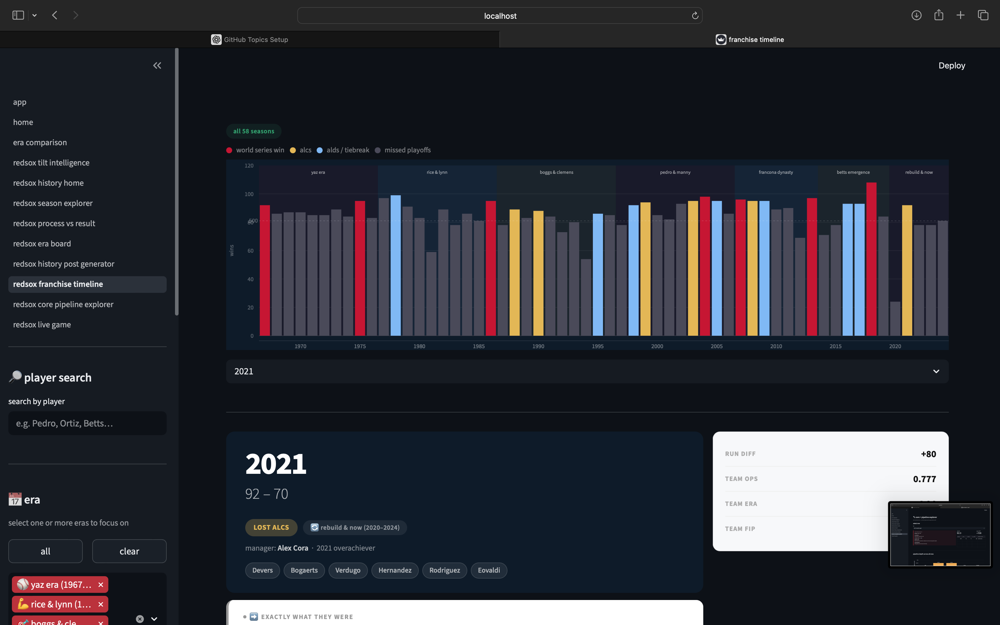

# frame² — sports intelligence engine


frame² is a lightweight sports analytics and content engine built to explain games through **process vs result**.

the goal is simple:

**observe → detect the edge → explain the mechanism → generate insights**

---

## demo

example output generated by frame²:

observation  
2024 red sox finished 81-81.

mechanism  
run differential was neutral, but the offense relied heavily on duran as the lone consistent process driver.

implication  
the result and underlying process were aligned — an average team produced an average outcome.

---

## core ideas

most fans watch the scoreboard.

frame² tries to explain **why the scoreboard moved**.

the engine focuses on identifying hidden drivers such as:

- contact quality
- plate discipline
- run expectancy swings
- roster structure
- development pipeline

these signals help reveal the **mechanism behind outcomes**.

---

## features

### red sox intelligence dashboard

explore historical eras and identify what drove each team’s success.

### franchise timeline

visualize the full history of the franchise, including:

- world series seasons
- playoff runs
- rebuilding periods
- emerging cores

### core + pipeline explorer

see which players carried each era and how strong the organizational pipeline was.

### history post generator

automatically convert analytics into ready-to-post insights.

---

## screenshots

### core + pipeline explorer

<p align="center">

</p>

### franchise timeline

<p align="center">

</p>

### history post generator

<p align="center">

</p>

---

## roadmap

planned upgrades for frame²:

- live game ingestion
- automated tilt detection
- multi-sport support (nba / nfl / mlb)
- real-time insight generation
- integration with social publishing pipelines

---

## project structure

frame2_mvp/

├── app.py                # streamlit dashboard  
├── engine.py             # edge detection + analysis logic  
├── data.py               # example game/team inputs  
├── posts.py              # insight → post generator  
├── images/               # README screenshots  
├── scripts/              # utilities + helpers  
└── requirements.txt      # python dependencies

---

## run locally

```bash
git clone https://github.com/dualityframework-ux/frame2_mvp.git
cd frame2_mvp

pip install -r requirements.txt
streamlit run app.py
